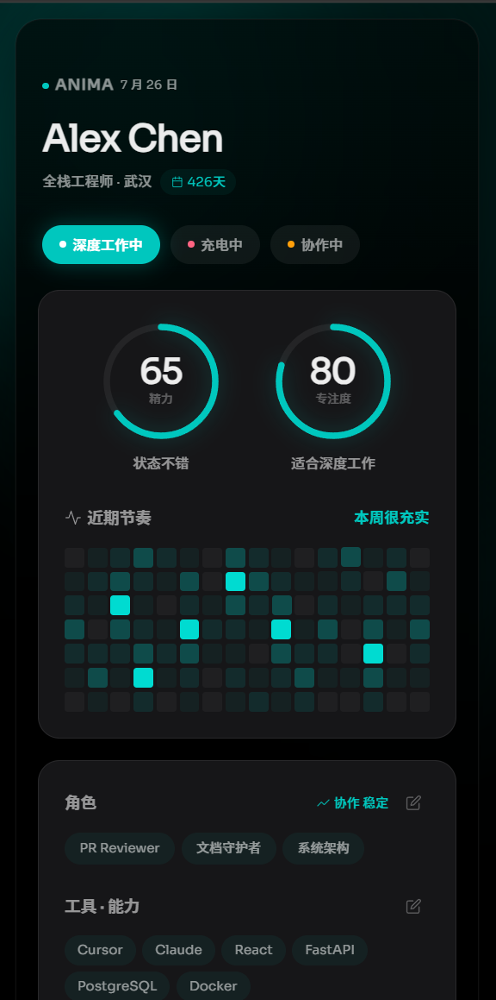
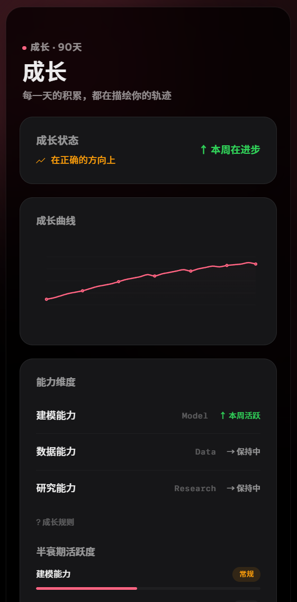
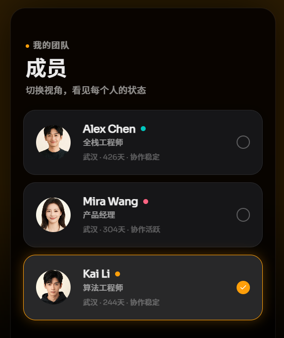

# Project Anima — 角色卡提案

## 基本信息

- **申请岗位**：产品经理
- **GitHub ID**：canoneko
- **完成耗时**：约 32 小时（含原型迭代 7 个版本）
- **原型链接**：`prototype/prototype.html`，单文件零依赖，浏览器直接打开即可运行

### AI 使用披露

Claude/Kimi 在以下环节提供了输入，我做筛选和判断：

- **SYB 招聘站信息抓取**：AI 帮我抓取 syb.team 的招聘流程和公司文化信息，我根据原文自行提炼设计约束
- **RPG 原理梳理**：AI 列出约 15 个 RPG 元素及底层逻辑。**我选了 7 个，拒绝了 8 个**（战斗/金币/交易/抽卡/死亡/组队/成就/每日任务）
- **成长机制设计**：AI 提出指数衰减模型 + PR 规模分 + 难度系数。**全部拒绝**——改为 task_type 新颖度判断
- **架构设计**：AI 建议事件溯源 + 快照双表模式。**采纳并适配**
- **原型实现**：AI 辅助生成 HTML/CSS/JS 代码（7 个版本）。**我定义视觉方向和交互逻辑，审核每一版**
- **我明确拒绝的 AI 建议**：给"创造力"设创造力指数、展示"团队排名"、用 NLP 自动判定任务类型、设计工业信息系统风格原型

> 哪些 RPG 原理值得翻译、哪些必须拒绝、为什么选择非量化、原型的视觉方向——这些判断由我做出。

### PR 描述

- **设计思路一句话**：借鉴 RPG 的设计智慧但不给数值，让角色卡成为自我认知工具而非组织评估工具——模糊状态 + 趋势方向，精确计算留在后端
- **自认为最强的一个判断**：非量化设计。不要精确数值，只要模糊状态和方向指示。它解决了刷分、比较、Goodhart 定律等崩坏风险，同时保留足够的方向信号帮助自我认知
- **最没把握的地方**：岗位不平等——代码 diff 自动化程度远高于 PM 的 PRD 迭代，非量化缓解了比较但没根治。动机挤出——这个悖论我堵不上

---

## 1. 我读懂的 SYB

SYB 诚信、开放，具有极客的创造理念，同时也具有人文关怀的特质，是一个小而美的，以产出为重要标准的研发团队。效率优先是团队的理念，团队对于新技术保持着开放的态度，同时以创造性的方式来做事。

---

## 2. 设计目标与「不属性化的保留地」

### 核心主张

> **一张角色卡应该让 SYB 成员更了解自己，而不是让组织更方便地评估他们。**

角色卡首先是**自我认知工具**，其次通过帮助成员了解自己的状态来间接提升团队效率——但不作为组织评估依据。SYB 衡量人的标准是 diff（广义的 diff，任何可见的产出变化都是 diff），不是角色卡上的数字。

### 设计哲学

不告诉用户"你的能力值是 78 分"，而是告诉他"你最近在进步"或者"也许该休息一下了"。精确数值会制造不必要的比较；把人的能力量化到个位数没有实际意义。面向用户展示**模糊状态描述 + 趋向方向**，精确计算留在后端，同时保留一些启发性数据让用户看见自己的状态变化。

### 设计目标

1. **减少认知负担**：核心自动运行，手动操作仅限身份信息维护和状态切换
2. **支持自我认知**：让成员看见精力节奏、能力变化方向和成长趋势
3. **促进协作匹配**：通过状态标记和能力图谱帮助找到合适的协作对象
4. **提供正向反馈**：从产出变化中看到努力的结果
5. **绝不作为考核依据**：没有排名比较与合格线或者淘汰机制

### 不属性化的保留地

| 保留地 | 理由 |
|---|---|
| **人格特质** | "聪明"是硬门槛，不是可比较的属性。量化为 85 分 vs 90 分，既不全面也不够尊重人 |
| **个人成长意愿** | "野心"是内驱力，量化会把它变成排行榜，这正是 SYB 反对的 KPI 逻辑 |
| **人际温度** | "温度"是伦理立场，不是能力。数值化有把它降维成"魅力值"的风险 |
| **创造力与判断力** | 以**能力图谱的定性描述**来呈现，不给数值 |

> "不属性化"不是"不展示"，而是"不给数值"。能力图谱用中性定性标签（常用/了解/探索中/未涉猎）+ 互评背书来描述。刻意避免"强/弱"这类词汇——"探索中"暗示"正在路上"而非"不够好"。

---

## 3. 角色卡设计

### 3.1 从游戏机制到日常节奏

我借鉴了 RPG 属性系统的几条底层设计智慧，但剥离了"游戏化"的外壳。

| 游戏设计智慧 | 底层原理 | SYB 场景映射 | 用户看到的 |
|---|---|---|---|
| **HP（生命值）** | 稀缺资源池，强制节奏管理 | 远程协作没有"下班信号"，容易 burnout | **精力状态**：模糊描述——"精力充沛 / 状态不错 / 该休息一下 / 好好歇歇吧"，环形进度条中心显示数值（如 65），起提示作用 |
| **MP（魔力值）** | 高价值技能的能源预算 | 深度工作是最稀缺的产出 | **专注度**：类似描述——"适合深度工作 / 可以做浅层任务 / 注意力有些分散"，环形进度条中心显示数值（如 80） |
| **EXP（经验值）** | 累积成长的可见性 | 让成员看见自己的产出积累 | **成长轨迹**：时间线曲线，只展示趋势方向——"本周很充实 / 稳步前进中 / 正在蓄力 / 刚开始热身" |
| **技能树** | 能力维度的可视化分布 | 让成员看见自己的能力地图 | **能力图谱**：定性标签（常用 / 了解 / 探索中 / 未涉猎）+ 互评背书，不用"强/弱"这类带有心理暗示的词 |
| **职业标签** | 动态定位而非固定职称 | SYB 扁平，不做传统职称 | **角色标签（Role Tag）**：动态标签，如"PR Reviewer""文档守护者" |
| **Buff/Debuff** | 临时状态可见性 | 远程协作最大的信息成本是状态不可见 | **状态标记**："深度工作中" / "充电中" / "协作中"，各有情绪色——青绿/粉红/暖橙 |
| **装备** | 工具偏好的可见性 | 工具栈透明化帮助协作匹配 | **工具栈**：成员常用工具列表，自动从 GitHub profile 和日常协作中提取 |

> **未采纳的 RPG 机制**：战斗/伤害（扭曲协作）、金币/交易（引入竞争囤积）、随机掉落/抽卡（与"诚信"冲突）、死亡/复活（引入惩罚）。选择标准：只翻译帮助自我认知的机制，拒绝引入竞争、惩罚或随机性的机制。

### 3.2 成长动力：鼓励开拓，而非鼓励重复

**后端逻辑（不对用户暴露）**：不计算分值，只判断方向。

```
判断信号（按优先级）：
1. 首次在该 task_type 产出 → "↑ 你开始探索 [领域] 了"
2. 最近 7 天有产出且 task_type 多样化 → "↑ 本周活跃"
3. 有产出但 task_type 集中单一 → "→ 保持中"
4. 没有 → "↓ 较少接触"

去掉 PR 规模分和难度系数：
- PR 行数不代表工作价值
- 难度系数用关键词匹配无法跨语言
- 非量化设计中更简单的逻辑就够了
```

> **坦诚的取舍**：同一领域持续深耕可能被标记为"保持中"而非"本周活跃"。需要更细粒度的 task_type 分类，这是工程化阶段的事。
>
> **同类型任务难度差异**：非量化设计中不计算分值，不需要难度系数。但难度差异的信号仍被保留（首次开拓 vs 常规产出）。精确到单个任务难度的区分，维护成本远超其价值。

**用户看到的**：成长方向指示（↑ / → / ↓）、开拓提醒、重复同类任务提示。看不到任何公式。

### 3.3 广义的 diff：不同岗位的成长都是可见的

diff 不只是代码变更——任何可见的产出变化都是 diff。

| 岗位 | diff 的形式 | 成长维度 | 触发事件 |
|---|---|---|---|
| **全栈工程师** | 代码 PR、技术方案文档 | 代码能力 / 架构能力 / 审查能力 | PR merged、技术方案被采纳 |
| **产品经理** | PRD 版本迭代、调研报告 | 设计能力 / 协调能力 / 洞察能力 | PRD 被采纳、调研报告被引用 |
| **算法工程师** | 实验日志、模型迭代 | 建模能力 / 数据能力 / 研究能力 | 实验指标提升、技术分享被引用 |

**跨岗位认可**：引入"协作影响力"机制——产出被其他岗位引用或采纳时触发协作事件记录（非数值化）。

> **坦诚承认**：代码类 diff 的自动化程度仍然最高。岗位隔离 + 协作影响力缓解了一部分，但无法完全消除。

### 3.4 能力图谱（定性描述）

能力图谱不给数值，只给定性标签和互评背书。标签从"强/中/弱/未涉猎"改为"常用/了解/探索中/未涉猎"——"弱"有优绩主义色彩，"探索中"暗示"正在路上"而非"不够好"。

---

## 4. 属性经济系统（内部逻辑）

> 本节描述的是后端计算逻辑。这些数值不对用户暴露。用户看到的是基于这些计算推导出的模糊状态描述和趋势方向。

### 4.1 状态变化

| 属性 | 内部计算方式（用户不可见） | 用户看到的状态 |
|---|---|---|
| **精力（Energy）** | 基于产出节奏的推断值（0-100，用户不可见）。**局限**：无法真正知道用户何时睡觉或开会，这是状态推测而非精确计量 | 模糊状态描述 + 环形进度条数值 |
| **专注度（Focus）** | 类似推断值。**局限**：从产出模式反推，不是真正的注意力监测 | 模糊状态描述 + 环形进度条数值 |
| **成长（Mastery）** | 按岗位维度分别计算，见 3.2 节 | ↑ / → / ↓ / ○ 暂无数据 |

**观测周期**：以最近 1 天和最近 7 天两个窗口展示状态——减少比较压力、增强即时反馈、无总分数可刷。

### 4.2 任务类型自动判定

复用 GitHub 现有标签体系，不自建分类法：PR 有 label → 取 label；无 label → 文件路径推断；均无 → "other"；成员可手动覆盖（覆盖写入日志，可追溯）。不采用自建分类法（维护成本高）和 NLP 自动分类（黑箱、牺牲可追溯性）。

### 4.3 半衰期机制

能力维度长时间无产出接触，从"活跃"滑向"常规"再滑向"休整"。用户看到的是标签变化，不是数值衰减。默认 6 个月，可由 PR 调整（3 个月内=活跃，3-6 月=常规，超 6 月=休整）。参数调整：任何成员提出修改建议并说明理由，48 小时无反对则生效。

### 4.4 数据快照与历史归档

```
GitHub Webhook → event_queue → Worker 计算属性变化
  → attribute_history（追加）→ attribute_snapshot（upsert）
查询：snapshot O(1)，成长轨迹 history（按需分页）
```

### 4.5 长期风险评估

通过非量化 + 短周期设计，大部分崩坏风险已被大幅降低：刷分和属性歧视基本消除，Goodhart 定律风险大幅降低。技术栈锚定和岗位不平等部分缓解。**唯一不变的风险**：状态标记形式化——动机挤出的子问题，非量化无法完全解决。

### 4.6 冷启动策略

- **Day 0**：精力/专注度"○ 暂无数据"（空环）；成长方向引导文案；热力图全灰；能力图谱引导手动添加
- **Day 1-7**：首个产出后，精力/专注度推断初始状态，成长方向显示"↑ 你开始探索 [领域] 了"
- **Day 7+**：≥2 次产出后正常判断生效

**原则**：冷启动期间全部用"○ 暂无数据"而非默认数值。

### 4.7 系统治理

1. **复杂度预算**：每日手动操作次数低，不频繁操作即可正常使用
2. **季度健康度审查**：维度使用率 < 20% 连续 2 季度 → 30 天观察 → 归档（不删历史）
3. **年度匿名审计**：全员匿名反馈，审计报告以 PR 公开

> 系统的任何规则都可以被质疑，渠道是 PR，不是私下吐槽。

---

## 5. 崩坏剧本

| 场景 | 风险 | 描述 | 缓解措施 | 堵不上的部分 |
|---|---|---|---|---|
| **为"方向"而优化** | 低 | 刻意增加产出频率获取"↑ 活跃"提示 | task_type 新颖度判断确保重复产出收敛为"→ 保持中" | 持续切换方向以维持活跃——但这本身是开拓 |
| **状态标记形式化** | 中 | "深度工作中"变成"请勿打扰"按钮 | PR 活跃度与状态不匹配时提醒 | **动机挤出** |
| **互评礼尚往来** | 低 | "你给我背书，我也给你" | 互评需附具体事例，空泛背书权重降为 0 | "具体事例"的判定标准模糊 |

### 坦然承认堵不上的空子

> **动机挤出**：这是所有追踪系统的根本悖论。通过非量化设计，我们把动机挤出的方向从"追求高分"转向了"追求积极状态"——后者至少是健康的自我关注。但我堵不上的是：只要系统在追踪任何东西，就有人会在意它。Anima 能做的是让这个"在意"的方向尽可能健康，而非完美。

---

## 6. 原型

### 6.1 可交互原型链接

**文件位置**：`prototype/prototype.html`（与 solution.md 同目录下的 prototype 子目录）
**运行方式**：浏览器直接打开，零构建依赖，单文件包含全部 HTML/CSS/JS。

```bash
cd prototype && python -m http.server 8000
# 访问 http://localhost:8000/prototype.html
```

### 6.2 原型截图





### 6.3 原型设计过程

我先用 PS 绘制了视觉原型，确定整体风格和交互流程后，再由 Trae Work 辅助生成可交互的 HTML/CSS/JS 代码，经历了 7 个版本迭代。AI 在 DOM 结构、CSS 变量、SVG 环形进度条、热力图等方面提供了工程实现，但视觉方向和交互逻辑由我定义。AI 的第一版输出是典型的"管理系统 Dashboard"风格（浅灰背景、表格布局、蓝色强调色），我全部推翻——SYB 要的是"温度"不是"效率面板"。最终版采用纯黑底 + 三套情绪色（青绿/粉红/暖橙）+ Apple 式毛玻璃效果，切换成员时整体色调跟随状态变化。

详细的 AI 采纳/拒绝记录见第 8 节。

### 6.4 原型功能

1. **角色卡面板**：头像 + 姓名 + 岗位标签 + 状态标记 + 精力/专注度环形进度条（中心显示数值）+ 成长状态摘要
2. **三成员切换**：底部 Dock 导航，3 位成员（全栈/PM/算法），切换时背景情绪色跟随状态变化
3. **行为模拟**：6 个操作按钮（PR / 深度工作 / 休息 / Review / 会议 / 开拓），触发状态变化 + 事件日志
4. **状态切换**：三种状态（深度工作中/充电中/协作中），整体情绪色跟随
5. **成长轨迹**：最近 30 天 SVG 曲线，只展示趋势方向
6. **能力维度**：定性标签 + 成长方向 + 半衰期活跃度
7. **活跃热力图**：近 16 周，色阶随情绪色变化
8. **个人资料编辑**：角色标签、工具·能力、个人简介均支持内联编辑
9. **GitHub 同步模拟** + **响应式布局**

> **原型边界**（设计中提及但未实现）：静默模式、互评背书交互（仅展示背书人数）、协作事件详细记录、年度/季度审查入口、重复同类任务自动提示、冷启动空状态。

### 6.5 工程化路径（供 Relay 参考）

**前端（React）**：`MemberCard`、`AttributeBar`、`StatusBadge`、`SkillMap`、`ActionLog`、`GrowthChart`。

**后端（FastAPI + PostgreSQL）**：核心模型 `Member`、`AttributeSnapshot`、`MasteryDimension`、`AttributeHistory`、`SkillMapEntry`。流转：GitHub Webhook → FastAPI → task_type 判定 → 方向计算 → history 写入 → snapshot 更新 → 前端 SSE/轮询。降级：Webhook 不可用时手动提交。所有中间件 async/await。

---

## 7. 我注入的价值观

| 价值观 | 落在哪个具体机制上 | 为什么 |
|---|---|---|
| **诚信** | 属性变更历史全公开可追溯（Git commit 式日志）；AI 使用如实披露 | 这是团队的核心价值观 |
| **开放** | 角色卡全员可见（静默模式可选）；互评背书公开；参数调整走公开 PR | 保持开放有助于团队成员之间互相了解 |
| **高效** | 最大限度自动化；异步沟通优先（PR 不开会）；数据快照 O(1) 查询 | 把时间投进工具，换来消失的沟通成本 |
| **极致** | 非量化但方向精确：task_type 新颖度确保"重复"和"开拓"的信号准确传达 | 极致不只是狭隘的"分数最高"，在正确的方向上持续突破更加重要。 |
| **温度** | 非量化展示：不告诉"你值多少分"，告诉"你最近的状态如何"；允许不看 | 你首先是一个人，其次才是一个工程师 |

---

## 8. 设计日志

### 8.1 推翻过的方案

- **综合实力评分**（Energy + Focus + Mastery 加权平均）——推翻。任何"总分"都会变成排行榜，只要数字在那儿，人就会比较。**反思**："总分"太符合产品经理的直觉——什么都要汇总指标。这个直觉本身就是 KPI 文化的产物
- **统一维度体系**（全员可比）——推翻。不同岗位的 diff 频率天然不同。**反思**：AI 默认推荐"同一把尺子量"的结果公平，SYB 需要的是机会公平（每个人都可以被承认）
- **"温度值"**（被感谢次数 = 温度值）——推翻。温度是伦理立场，不是能力。一旦变成数值，它就变成"魅力值"——可被优化、可被表演。**这是整个设计过程中最难的判断之一**，因为拒绝它意味着承认 SYB 最核心的价值观不可量化
- **等级系统**（Lv.1 到 Lv.99）——推翻。等级是排名的变体，只是更花哨的外衣
- **每日任务 / 连续签到**——推翻。提高日活是 SaaS 思维。AI 的默认优化目标（engagement）和 SYB 的目标（真实产出）根本不是同一件事

### 8.2 AI 使用记录

| 环节 | AI 给了我什么 | 我的判断 | 过程中的思考 |
|---|---|---|---|
| **SYB 招聘站信息抓取** | 从 syb.team 抓取招聘流程、公司文化（诚信→开放→高效→极致→温度） | **采纳**，帮我快速建立上下文 | AI 会倾向于提取它觉得"可操作"的信息，忽略模糊但重要的东西。比如"不把人当耗材"，AI 容易把它简化成"不要 KPI"，但这两者并不是同一个概念 |
| **RPG 原理梳理** | 列出约 15 个 RPG 元素及底层逻辑，默认倾向"全部翻译" | **选择性采纳 7 个**，拒绝 8 个 | 我的判断标准是：这条机制是否涉及"人与人之间的对抗、惩罚或随机剥夺"。一旦协作场景出现"输赢"隐喻，可能不利于团队的健康发展 |
| **成长机制设计** | 指数衰减模型 + PR 规模分 + 难度系数 | **全部拒绝**，改为 task_type 新颖度判断 | 分数有时能给使用者激励，但标签性的回复可以避免分数在使用过程中成为异化的因素 |
| **架构设计** | 标准的事件溯源 + 快照双表模式 | **采纳并适配** | AI 的思路是对的，我增加了 Webhook 不可用时的手动提交降级方案（小团队无 DevOps），并要求所有中间件用 async/await |
| **原型实现** | 7 个版本的 HTML/CSS/JS，AI 默认倾向浅色主题、常见字体栈、传统卡片布局 | **部分采纳** DOM 结构、CSS 变量、SVG 环形进度条、热力图；**拒绝**了大部分视觉方向。我先用 PS 画原型再由 Trae Work 制作可交互版本 | AI 第一版是典型的管理系统 Dashboard 风格，我认为 SYB 要的是"温度"不是"效率面板"。最终版是纯黑底 + 三套情绪色 + Apple 式毛玻璃。AI 对"有温度的设计"理解不足，执行可以，判断不行 |

**我明确拒绝的 AI 建议**

| AI 建议 | 表面合理性 | 我拒绝的理由 | 冲突的设计原则 |
|---|---|---|---|
| **给"创造力"设创造力指数（0-100）** | 创造力是关键特质，量化后可追踪"增长" | 创造力是偶发性的涌现，不是线性积累的技能。一旦设为指数，成员会为"提升分数"而刻意做"看起来有创造力"的事——Goodhart 定律。属于"不属性化保留地" | 不属性化的保留地 |
| **在角色卡上展示"团队排名"** | 排名激励竞争 | 排名把人变成可比较的资源，直接摧毁非量化设计的核心目标 | 温度 + 非量化设计 |
| **用 NLP 自动判定任务类型** | 自动化程度最高 | NLP 分类是黑箱，成员不知道"为什么这个 PR 被分到这个类别"。与"诚信→可追溯"冲突，而且复杂度高 | 诚信→可追溯 |
| **设计工业信息系统风格原型** | 科技感强 | 深墨色+青色传达的是"监控""控制台"的感觉——管理系统，不是自我认知工具。最终选择了纯黑底+情绪光谱 | 温度（视觉调性） |

> **判断标准**：AI 产生的方案如果和核心设计主张或 SYB 价值观有冲突，或者在工程实现上有困难，我都会拒绝。

### 8.3 遗憾

1. **岗位不平等无法完全消除**：代码 diff 自动化程度远高于 PRD 迭代
2. **动机挤出是结构性悖论**：非量化把"在意"转向了健康的自我关注，但堵不上
3. **原型不是真系统**：vibe coding 能演示概念，工程化需要大量工作
4. **非量化牺牲了精确性**：精准的数据不是目的，传达信息才是根本需求
